# dibimbing-belajar-github

## Langkah Pengerjaan
1. **Create Repository di Github**
    Repository dibuat dg nama `dibimbing-belajar-github`
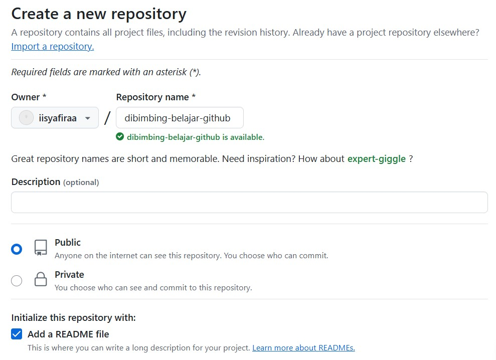

2. **Clone Repository ke Local**
    Clone repository ke local menggunakan GIT
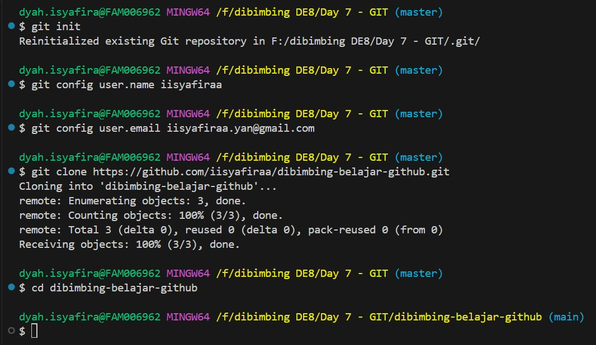

3. **Files**
    - File Python `read_csv.py` untuk membaca file CSV
    - File CSV `username.csv` berisi data yg digunakan
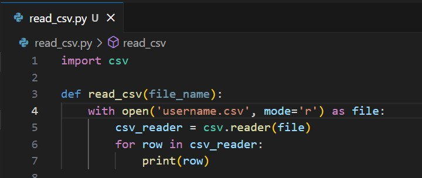

4. **Create New Branch**
    Create branch `feature/read-csv` untuk new feature
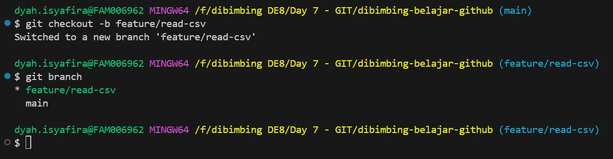

5. **Commit and Push**
    Commit perubahan dan push ke Github
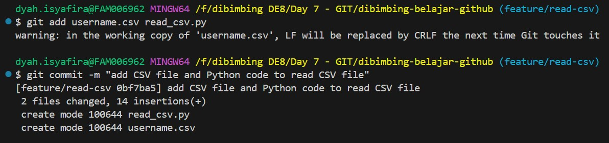
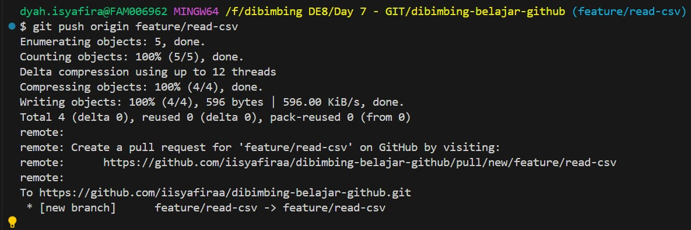

6. **Create Pull Request**
    Create pull request from branch `feature/read-csv` to `main`
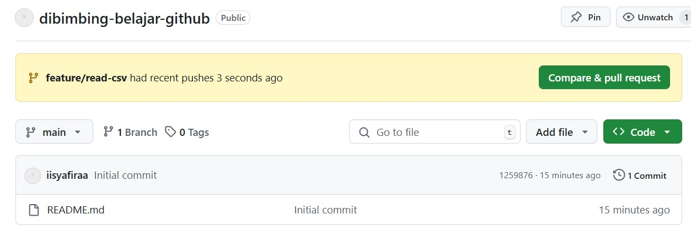
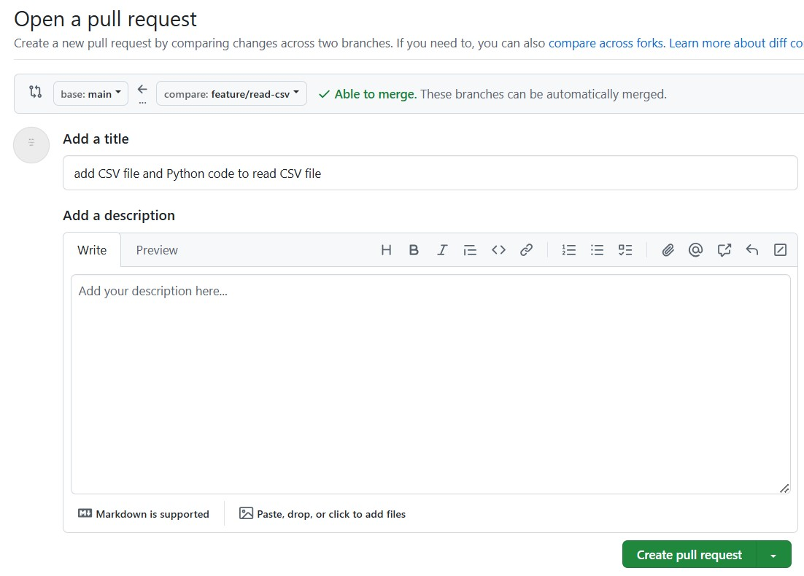
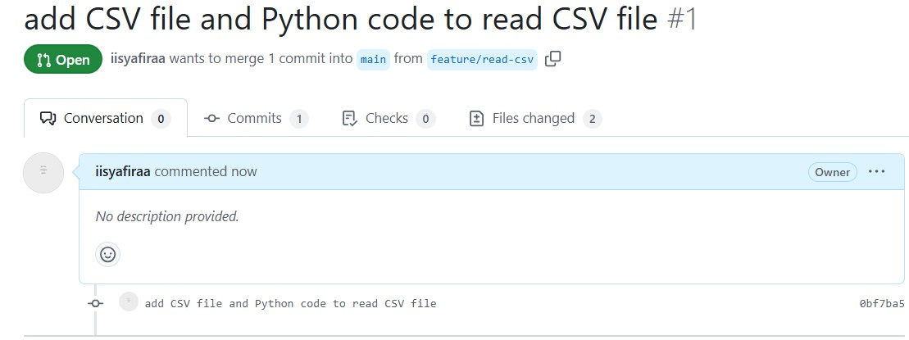

7. **Merge Pull Request**
    Merge pull request di Github
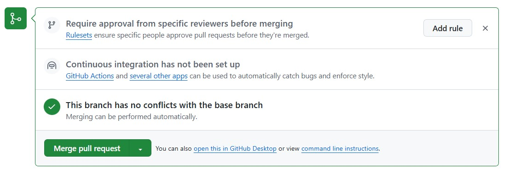
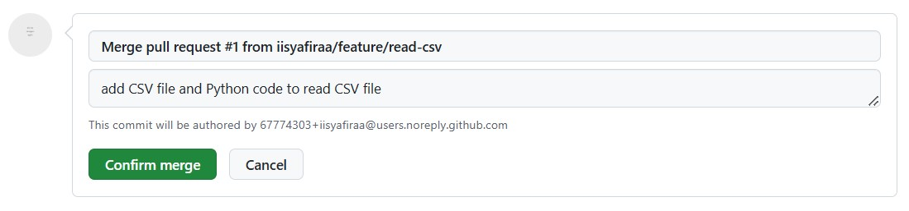
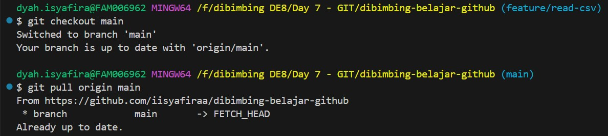
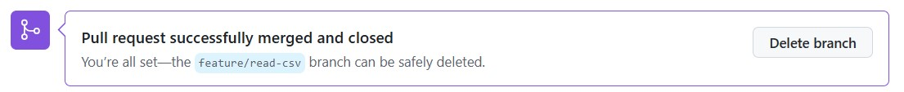

8. **Pull Perubahan ke Local**
    Pull remote main branch to local main branch

